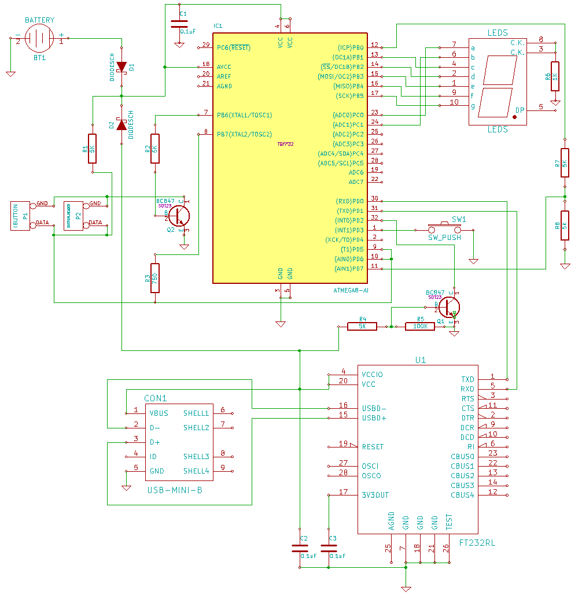
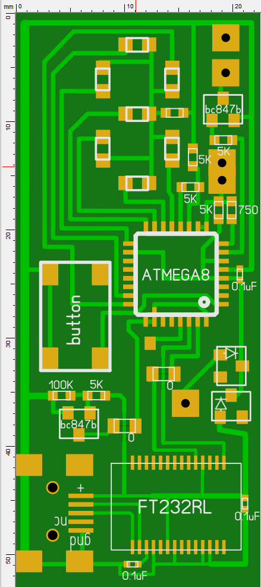

Эмулятор домофонных ключей iButton/Cyfral/Metacom
=================================================

Устроство способно считывать домофонные ключи iButton/Cyfral и имитировать ключи iButton/Cyfral/Metacom для открытия домофонов. Таким образом, можно в одном брелке носить ключи сразу от многих дверей. Есть возможность подключить устройство по USB к компьютеру.

Схема
-----

Компоненты и их предназначение:
* **IC1** - микроконтроллер ATMEGA8/ATMEGA8A/ATMEGA8L;
* **U1** - USB-контроллер FT232RL, нужен для подключения устройства к компьютеру;
* **CON1** - miniUSB разъём;
* **BT1** - батарейки, дающие 5 вольт;
* **D1** и **D2** - диоды (желательно шоттки), которые изолируют питание от батареи от питания от USB;
* **P1** - "таблетка" iButton, используется для подключения к домофонам;
* **P2** - контакты считывателя ключей, используются для подключения к ключам;
* **R1** - резистор, подтягивающий линию 1-wire к VCC;
* **R2** - токопонижающий резистор для управления транзистором **Q2**;
* **R3** - резистор, ещё сильнее подтягивающий линию к VCC для считывания ключей Cyfral;
* **R4** - токопонижающий резистор, используется для открытия **Q1** и определения подключения к USB;
* **R5** - подтягивает базу **Q1** к земле, чтобы закрывать его, когда нет подключения к USB;
* **R6** - токопонижающий резистор для светодиодов, достаточно одного, т.к. одновременно они не горят;
* **R7** и **R8** - делитель напряжения для одного из входов компаратора, чтобы считывать ключи Cyfral;
* **Q1** - транзистор для определения подключения к USB;
* **Q2** - транзистор для включения земли на считывателе и эмуляторе, чтобы не сажать батарейки, случайно замкнув контакты в кармане;
* **C1**, **C2** и **C3** - конденсаторы для фильтрации питания;
* **SW1** - единственная кнопка для управления устройством;
* **LEDS** - семь светодиодов в форме восьмёрочки для отображения номера ключа.

Вариант печатной платы:

Процесс прошивки
----------------
Рекомендуется сначала прошить бутлоадер из директории "Bootloader", чтобы потом иметь возможность обновлять прошивку по USB, без подключения программатора. Бутлоадер сконфигурирован так, что режим обновления прошивки будет включаться, если при запуске (не при пробуждении!) устройства зажата кнопка (она одна), при этом в режиме бутлоадера будет гореть средний светодиод.
Фьюзы: 
* Low: 0xE4
* High: 0xDA

После запуска бутлоадера для обновления или первичной установки прошивки нужно просто подключить устройство по USB, определить его виртуальный COM порт, вписать его в Makefile и набрать "make program".

Если бутлоадер не нужен, то сразу прошивать основную прошивку, используя фьюзы:
* Low: 0xE4
* High: 0xD9

Использование
-------------

Управление производится всего одной кнопкой. При её первом нажатии устройство включается. Кратковременным нажатием кнопки производится выбор ключа, номер которого отображается светодиодами. Когда нужный ключ выбран, достаточно приложить контакты к считывателю домофона.

Длительное нажатие на кнопку переводит устройство в режим считывания ключей, при этом мигает средний светодиод. В этот момент нужно приложить ключ к контактам считывателя ключей. Если считывание прошло успешно, отобразится номер, под которым ключ занесён в память.

Если устройство было включено длительным нажатием кнопки, оно отобразит цифру "0", это означает, что включен режим "вездехода", используя не прочитанные заранее ключи, а несколько общеизвестных универсальных кодов, которые работают с некоторыми домофонами.

Подключение по USB
------------------
Для синхронизации с компьютером используется USB. Клиент под Windows: https://github.com/ClusterM/ibutton_client
